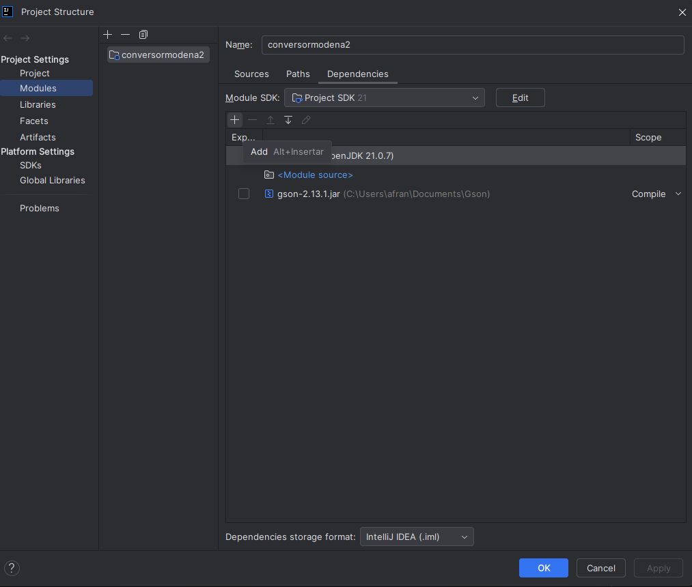

Este proyecto sirve para entender como se interactua con una API utilizando
conversor de monedas.
Datos importantes:
* Se debe descargar el archivo Gson de google el cual dejo su enlace:
  * https://mvnrepository.com/artifact/com.google.code.gson/gson
  * Sugiero la ultima versión
* Despues de su descarga se debe agregar este JAR al proyecto. Ver imagen en raíz:
  * conversormodena\img\guia-JAR-Gson.png
  * 
* Asegurar tener el apikey de API registrandose si así lo requiere, sientase libre de
   usar cualquier API. Yo usare esta:
  * https://app.exchangerate-api.com/dashboard